# Essence of Linear Algebra - Complete Study Guide

> Based on [3Blue1Brown's "Essence of Linear Algebra"](https://www.youtube.com/playlist?list=PLZHQObOWTQDPD3MizzM2xVFitgF8hE_ab) series by Grant Sanderson. This guide distills the geometric intuition behind linear algebra into a structured reference for students, self-learners, and anyone revisiting the fundamentals.

---

## Table of Contents

1. [Vectors](#chapter-1-vectors)
2. [Linear Combinations, Span, and Basis Vectors](#chapter-2-linear-combinations-span-and-basis-vectors)
3. [Linear Transformations and Matrices](#chapter-3-linear-transformations-and-matrices)
4. [Matrix Multiplication as Composition](#chapter-4-matrix-multiplication-as-composition)
5. [Three-Dimensional Linear Transformations](#chapter-5-three-dimensional-linear-transformations)
6. [The Determinant](#chapter-6-the-determinant)
7. [Inverse Matrices, Column Space, and Null Space](#chapter-7-inverse-matrices-column-space-and-null-space)
8. [Nonsquare Matrices as Transformations Between Dimensions](#chapter-8-nonsquare-matrices-as-transformations-between-dimensions)
9. [Dot Products and Duality](#chapter-9-dot-products-and-duality)
10. [Cross Products](#chapter-10-cross-products)
11. [Cross Products in the Light of Linear Transformations](#chapter-11-cross-products-in-the-light-of-linear-transformations)
12. [Cramer's Rule, Explained Geometrically](#chapter-12-cramers-rule-explained-geometrically)
13. [Change of Basis](#chapter-13-change-of-basis)
14. [Eigenvectors and Eigenvalues](#chapter-14-eigenvectors-and-eigenvalues)
15. [A Quick Trick for Computing Eigenvalues](#chapter-15-a-quick-trick-for-computing-eigenvalues)
16. [Abstract Vector Spaces](#chapter-16-abstract-vector-spaces)

---

## Chapter 1: Vectors

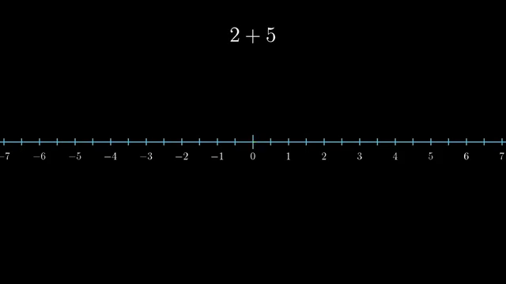

**[Watch on YouTube](https://www.youtube.com/watch?v=fNk_zzaMoSs)**

### The Big Idea

Vectors are the fundamental building block of linear algebra. There are three perspectives on what a vector is, and understanding all three is key.

### Three Perspectives on Vectors

| Perspective | What a vector is | Example |
|---|---|---|
| **Physics** | An arrow in space defined by length and direction | Force, velocity |
| **Computer Science** | An ordered list of numbers | `[square_footage, price]` |
| **Mathematics** | Anything with sensible addition and scalar multiplication | Abstract - explored in Chapter 16 |

### The Working Mental Model

For this series, think of a vector as **an arrow rooted at the origin** inside a coordinate system. The coordinates tell you how to get from the origin to the tip:

- **2D vector** `[3, -2]`: move 3 right, 2 down
- **3D vector** `[x, y, z]`: move along x, y, and z axes respectively

Every pair of numbers gives exactly one vector, and every vector gives exactly one pair of numbers.

### Vector Addition

To add two vectors, place the tail of the second at the tip of the first. The sum is the vector from the origin to the new tip.

Numerically: add corresponding components.

```
[1, 2] + [3, -1] = [1+3, 2+(-1)] = [4, 1]
```

**Intuition**: Each vector represents a "step." Addition means taking one step, then the other. The sum is the total displacement.

### Scalar Multiplication

Multiplying a vector by a number (a **scalar**) stretches, squishes, or reverses it:

- Multiply by 2: stretch to twice the length
- Multiply by 1/3: squish to a third
- Multiply by -1.8: flip direction, then stretch by 1.8

Numerically: multiply each component by the scalar.

```
2 * [3, 1] = [6, 2]
```

### Key Takeaway

> The power of linear algebra lies in the ability to **translate between geometric intuition (arrows in space) and numerical computation (lists of numbers)**. This back-and-forth is the heart of the subject.

---

## Chapter 2: Linear Combinations, Span, and Basis Vectors

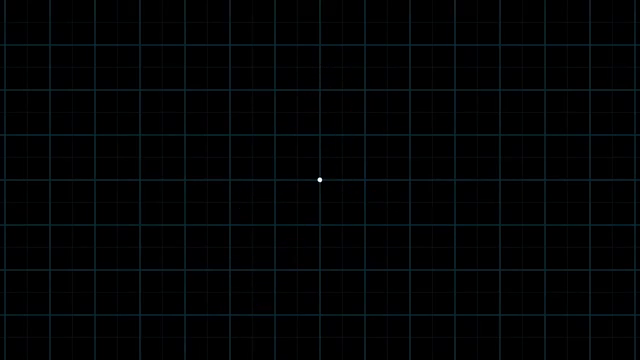

**[Watch on YouTube](https://www.youtube.com/watch?v=k7RM-ot2NWY)**

### The Big Idea

Coordinates are not just numbers - they are **scalars that scale special basis vectors**. This reframing unlocks the concepts of span, linear combinations, and linear independence.

### Basis Vectors

The standard basis vectors in 2D:

- **i-hat** (`[1, 0]`): unit vector in the x-direction
- **j-hat** (`[0, 1]`): unit vector in the y-direction

Any vector `[3, -2]` is really `3 * i-hat + (-2) * j-hat` - a **linear combination** of the basis vectors.

### Linear Combinations

A **linear combination** of vectors **v** and **w** is any expression of the form:

```
a * v + b * w
```

where `a` and `b` are scalars. You're scaling each vector, then adding the results.

### Span

The **span** of a set of vectors is the set of all possible linear combinations of those vectors - every point you can reach.

| Scenario | Span |
|---|---|
| Two non-parallel 2D vectors | All of 2D space (the entire plane) |
| Two parallel 2D vectors | A line through the origin |
| Two non-parallel vectors in 3D | A plane through the origin |
| Three non-coplanar 3D vectors | All of 3D space |

**Tip**: When thinking about collections of vectors, think of them as **points** (the tips) rather than arrows. The span of two vectors is the sheet/line/space of all points reachable.

### Linear Dependence vs. Independence

- **Linearly dependent**: One vector can be expressed as a linear combination of the others (it's redundant - removing it doesn't shrink the span)
- **Linearly independent**: Each vector adds a new dimension to the span (none is redundant)

### Basis (formal definition)

> A **basis** of a vector space is a set of **linearly independent** vectors that **span** the full space.

---

## Chapter 3: Linear Transformations and Matrices


**[Watch on YouTube](https://www.youtube.com/watch?v=kYB8IZa5AuE)**

### The Big Idea

If there's one topic that makes everything else in linear algebra click, it's this: **a matrix is a linear transformation, and a linear transformation is a matrix**.

### What is a Linear Transformation?

A transformation (function) is **linear** if it satisfies two visual properties:

1. **All lines remain lines** (no curves)
2. **The origin stays fixed**

Equivalently: grid lines remain parallel and evenly spaced.

**Mental model**: Imagine the entire grid of space getting "smooshed" or "morphed" - all points move, but in a structured way.

### Why Matrices Describe Linear Transformations

A linear transformation is **completely determined** by where it sends the basis vectors.

If i-hat lands on `[a, c]` and j-hat lands on `[b, d]`, then the matrix is:

```
| a  b |
| c  d |
```

To find where any vector `[x, y]` lands:

```
result = x * [a, c] + y * [b, d] = [ax + by, cx + dy]
```

This is **matrix-vector multiplication** - not a formula to memorize, but a consequence of linearity.

### Key Takeaway

> **Don't memorize the formula for matrix-vector multiplication.** Instead, think: "Where do the basis vectors land?" The columns of the matrix tell you, and everything else follows.

---

## Chapter 4: Matrix Multiplication as Composition

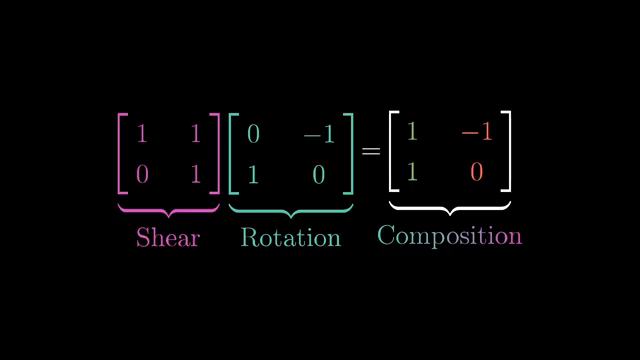

**[Watch on YouTube](https://www.youtube.com/watch?v=XkY2DOUCWMU)**

### The Big Idea

Multiplying two matrices means **applying one transformation after another**. The product matrix captures the combined effect.

### Composition of Transformations

If you first apply transformation **M1**, then transformation **M2**, the combined effect is a single linear transformation described by the product **M2 * M1**.

**To compute the product**: Apply M2 to each column of M1.

- First column of result = M2 applied to (first column of M1) = where i-hat ultimately lands
- Second column of result = M2 applied to (second column of M1) = where j-hat ultimately lands

### Important Properties

| Property | True? | Geometric intuition |
|---|---|---|
| **Associative**: (AB)C = A(BC) | Yes | Applying C then B then A is the same regardless of grouping |
| **Commutative**: AB = BA | **No!** | Rotating then shearing is different from shearing then rotating |

### Reading Order

Matrix multiplication reads **right to left**: in `M2 * M1`, you apply M1 first, then M2. This matches function notation: `f(g(x))` means apply g first.

### Key Takeaway

> Matrix multiplication is **not** an arbitrary algebraic operation. It's the natural way to describe doing one transformation followed by another. Associativity is obvious from this perspective; non-commutativity is expected.

---

## Chapter 5: Three-Dimensional Linear Transformations

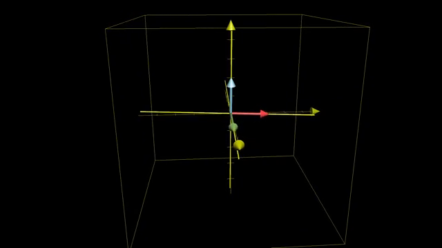

**[Watch on YouTube](https://www.youtube.com/watch?v=rHLEWRxRGiM)**

### The Big Idea

Everything from 2D carries over to 3D seamlessly. Once you understand the core ideas in 2D, 3D is just the natural extension.

### 3D Basis Vectors and Matrices

In 3D, there are three standard basis vectors:

- **i-hat** `[1, 0, 0]` - x-direction
- **j-hat** `[0, 1, 0]` - y-direction
- **k-hat** `[0, 0, 1]` - z-direction

A 3D linear transformation is described by a **3x3 matrix** whose three columns are where i-hat, j-hat, and k-hat land.

### Example: 90-degree rotation around y-axis

```
| 0  0  1 |
| 0  1  0 |
|-1  0  0 |
```

- i-hat goes to `[0, 0, -1]` (onto the negative z-axis)
- j-hat stays at `[0, 1, 0]`
- k-hat goes to `[1, 0, 0]` (onto the x-axis)

### Matrix Multiplication in 3D

Works the same way: apply the left matrix to each column of the right matrix. 3D matrix multiplication is essential for computer graphics and robotics, where 3D rotations are easier to understand as compositions of simpler rotations.

---

## Chapter 6: The Determinant

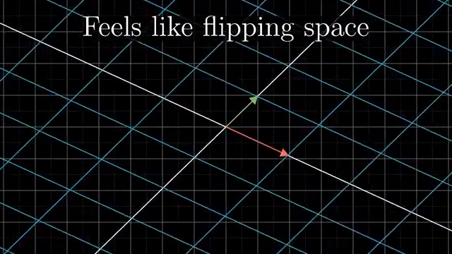

**[Watch on YouTube](https://www.youtube.com/watch?v=Ip3X9LOh2dk)**

### The Big Idea

The determinant measures **how much a transformation scales areas (2D) or volumes (3D)**.

### What the Determinant Tells You

| Determinant value | Geometric meaning |
|---|---|
| `det = 3` | All areas are scaled by 3 |
| `det = 1/2` | All areas are scaled by 1/2 |
| `det = 0` | Space is squished to a lower dimension (line or point) |
| `det = -2` | Areas scaled by 2, **and orientation is flipped** |

### Orientation

In 2D: j-hat starts to the **left** of i-hat. If after transformation j-hat ends up to the **right** of i-hat, the orientation has been **inverted** (determinant is negative).

In 3D: Use the **right-hand rule** with i-hat, j-hat, k-hat. If after transformation you need your **left hand**, orientation is flipped (negative determinant).

### Computing the Determinant

For a 2x2 matrix:

```
| a  b |
| c  d |  →  det = ad - bc
```

**Intuition for ad - bc**: `a` and `d` measure how much i-hat and j-hat are stretched along their respective axes. The `bc` term accounts for diagonal stretching/skewing.

### The Composition Rule

> **det(M1 * M2) = det(M1) * det(M2)**

This makes perfect sense: if M1 scales areas by 3 and M2 scales areas by 2, the composition scales areas by 6.

### Key Takeaway

> Checking if `det = 0` is a way of testing whether a transformation squishes everything into a lower dimension. This test is fundamental throughout linear algebra.

---

## Chapter 7: Inverse Matrices, Column Space, and Null Space

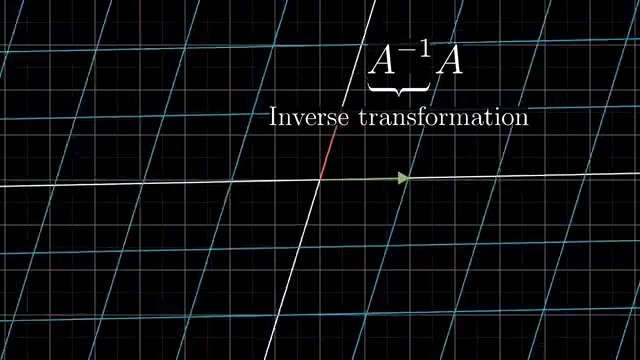

**[Watch on YouTube](https://www.youtube.com/watch?v=uQhTuRlWMxw)**

### The Big Idea

Systems of linear equations are really about asking: **"What input vector, when transformed, lands on a given output?"** The concepts of inverse, column space, rank, and null space all describe different aspects of this question.

### Systems of Equations as Transformations

A linear system like:

```
2x + 5y + 3z = -3
4x + 0y + 8z =  0
1x + 3y + 0z =  2
```

can be written as **Ax = v**, where A is the coefficient matrix, x is the unknown vector, and v is the output. The question becomes: which input vector x gets transformed by A into v?

### Inverse Matrix (when det(A) != 0)

If A doesn't squish space to a lower dimension (non-zero determinant), there exists a unique **inverse matrix A^(-1)** such that:

```
A^(-1) * A = Identity matrix (does nothing)
```

**To solve**: x = A^(-1) * v. Geometrically, you're "playing the transformation in reverse."

### When det(A) = 0 (No Inverse)

You can't "un-squish" a line back into a plane - that's not a function. **No inverse exists.** But a solution may still exist if v happens to land on the output of the squished space.

### Rank

The **rank** is the number of dimensions in the output of a transformation:

| Rank | Meaning for a 3x3 matrix |
|---|---|
| 3 | Full rank - output fills all of 3D space |
| 2 | Output is a plane (collapsed one dimension) |
| 1 | Output is a line (collapsed two dimensions) |

### Column Space

The **column space** is the set of all possible outputs - the span of the columns of the matrix. The rank equals the dimension of the column space.

### Null Space (Kernel)

The **null space** is the set of all vectors that land on the zero vector after the transformation.

- For a full-rank matrix: only the zero vector is in the null space
- For a rank-2 (3x3) matrix: a line of vectors maps to zero
- For a rank-1 (3x3) matrix: an entire plane maps to zero

When solving **Ax = 0**, the null space gives all solutions.

### Key Takeaway

> - **Inverse** tells you how to find the unique solution (when it exists)
> - **Column space** tells you when a solution exists (v must be in the column space)
> - **Null space** tells you the shape of the solution set

---

## Chapter 8: Nonsquare Matrices as Transformations Between Dimensions

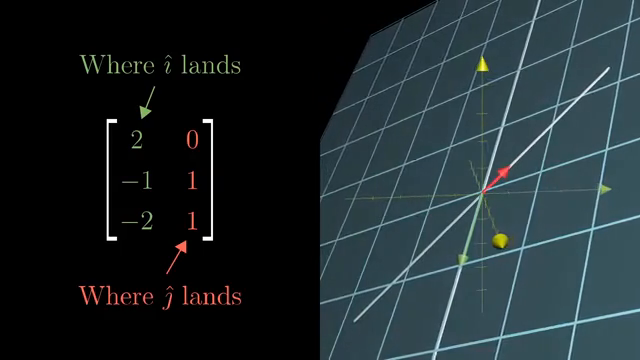

**[Watch on YouTube](https://www.youtube.com/watch?v=v8VSDg_WQlA)**

### The Big Idea

Non-square matrices represent transformations **between different dimensions**.

### Reading a Matrix's Shape

| Matrix size | Transformation |
|---|---|
| **3x2** (3 rows, 2 columns) | 2D → 3D (two basis vectors, each landing in 3D) |
| **2x3** (2 rows, 3 columns) | 3D → 2D (three basis vectors, each landing in 2D) |
| **1x2** (1 row, 2 columns) | 2D → 1D (number line) |

**Rule**: **columns** = dimension of input space, **rows** = dimension of output space.

### Why This Matters

A **1x2 matrix** takes 2D vectors and outputs numbers. This is closely related to the **dot product** (explored in Chapter 9).

A **2x3 matrix** squishes 3D space onto a 2D plane - a transformation that should feel "uncomfortable" to imagine going through.

The concepts of full rank and column space still apply: a 3x2 matrix can be full rank (rank 2) if its two columns are linearly independent, meaning the 2D input space maps to a 2D plane embedded in 3D.

---

## Chapter 9: Dot Products and Duality

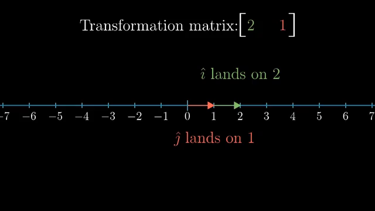

**[Watch on YouTube](https://www.youtube.com/watch?v=LyGKycYT2v0)**

### The Big Idea

The dot product connects **projection** and **linear transformations**. This connection is an example of **duality** - one of the deepest ideas in mathematics.

### The Standard View: Projection

The dot product of **v** and **w**:

```
v . w = (length of projection of w onto v) * (length of v)
```

| Condition | Dot product |
|---|---|
| Same direction | Positive |
| Perpendicular | Zero |
| Opposite direction | Negative |

Numerically: multiply corresponding coordinates, then add.

```
[1, 2] . [3, 4] = 1*3 + 2*4 = 11
```

**Order doesn't matter**: v . w = w . v (despite the projection seeming asymmetric).

### The Deep View: Duality

Here's the revelation. Consider a linear transformation from 2D to 1D (the number line). This is described by a **1x2 matrix**: `[a, b]`.

Applying this transformation to a vector `[x, y]`:

```
[a, b] * [x, y] = ax + by
```

This is **identical** to the dot product of `[a, b]` and `[x, y]`.

### The Duality Principle

> **Every linear transformation from nD to 1D corresponds to a unique vector**, and applying that transformation is the same as taking the dot product with that vector.

The **dual** of a vector is the linear transformation it encodes. The **dual** of a linear transformation (to 1D) is a vector.

### Why This Matters

When you dot a vector with a **unit vector u-hat**, you're projecting onto u-hat's line. The projection transformation is described by a 1x2 matrix whose entries are... the coordinates of u-hat. This is **not** a coincidence - it follows from a beautiful symmetry argument.

For a non-unit vector (say 3 * u-hat), the dot product gives the projection scaled by 3.

### Key Takeaway

> The dot product isn't just a computational trick. It reveals that **every vector secretly encodes a linear transformation** (projection onto its span). Vectors and transformations-to-1D are two faces of the same coin.

---

## Chapter 10: Cross Products

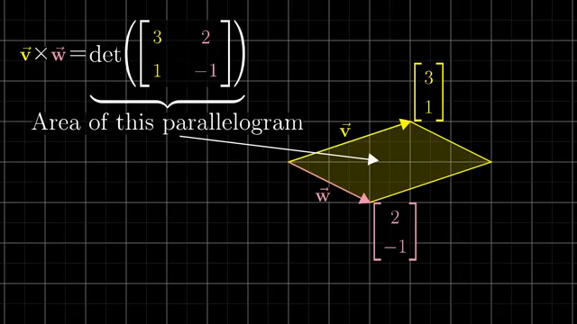

**[Watch on YouTube](https://www.youtube.com/watch?v=eu6i7WJeinw)**

### The Big Idea

The cross product produces a vector that is **perpendicular** to two input vectors, with a length equal to the **area of the parallelogram** they span.

### 2D Cross Product (a scalar)

For vectors v and w in 2D, the cross product is the **signed area** of the parallelogram they span:

```
v x w = det | v1  w1 |  = v1*w2 - v2*w1
            | v2  w2 |
```

- **Positive** if v is to the right of w
- **Negative** if v is to the left of w
- This is just the **determinant** of the matrix with v and w as columns

### 3D Cross Product (a vector)

For 3D vectors v and w, the cross product **v x w** is a new vector with:

- **Length** = area of the parallelogram spanned by v and w
- **Direction** = perpendicular to both v and w
- **Orientation** = determined by the **right-hand rule** (point index finger along v, middle finger along w, thumb points in direction of cross product)

### Computing the 3D Cross Product

Use the "notational trick" with basis vectors in a determinant:

```
        | i-hat  v1  w1 |
v x w = | j-hat  v2  w2 |
        | k-hat  v3  w3 |
```

Expand the determinant, and the coefficients on i-hat, j-hat, k-hat give the components of the cross product.

### Properties

- **Anti-commutative**: w x v = -(v x w)
- Perpendicular vectors produce larger cross products
- Parallel vectors produce zero cross products
- Scaling one vector by k scales the cross product by k

---

## Chapter 11: Cross Products in the Light of Linear Transformations

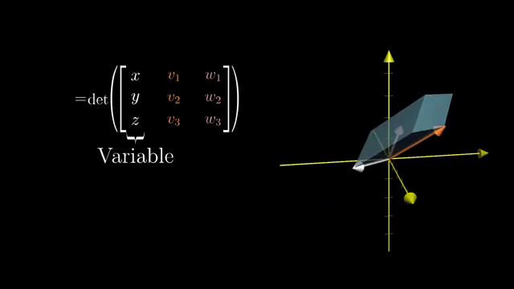

**[Watch on YouTube](https://www.youtube.com/watch?v=BaM7OCEm3G0)**

### The Big Idea

The cross product isn't an arbitrary formula - it emerges naturally from **duality** applied to a specific linear transformation involving volumes.

### The Construction

1. **Define a function**: Given fixed vectors v and w, define `f(x, y, z) = det([x,y,z], v, w)` - the signed volume of the parallelepiped formed by `[x,y,z]`, v, and w.

2. **This function is linear**: It takes 3D vectors to numbers (it's a 3D → 1D transformation).

3. **By duality**, there must be a unique vector **p** such that:
   ```
   f([x,y,z]) = p . [x,y,z]
   ```
   Taking the dot product with p gives the same result as computing the determinant.

4. **That vector p is the cross product** v x w.

### Why the Formula Works

The "trick" of putting basis vectors in the first column of a determinant is actually computing the dual vector of this linear transformation. The geometric properties (perpendicular to v and w, length equals parallelogram area) follow directly:

- **Perpendicular**: The dot product p . x equals the volume of the parallelepiped. Volume is maximized when x is perpendicular to the v-w plane, and zero when x lies in that plane. This means p must be perpendicular to both v and w.
- **Length = area**: When x is a unit vector perpendicular to v and w, the volume equals the base area times height 1. So p . x = area, meaning |p| = area.

### Key Takeaway

> The cross product is the **dual vector** of the "signed volume" function. The notational trick with determinants is not arbitrary - it's a direct computation of this dual.

---

## Chapter 12: Cramer's Rule, Explained Geometrically

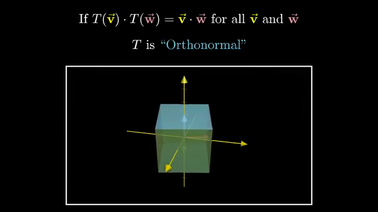

**[Watch on YouTube](https://www.youtube.com/watch?v=jBsC34PxzoM)**

### The Big Idea

Cramer's Rule solves systems of linear equations using determinants. The geometric insight is that **coordinates can be read off as signed areas/volumes**, and these areas transform predictably under linear maps.

### The Geometric Insight

Instead of thinking of coordinates as dot products with basis vectors, think of them as **signed areas**:

- The **y-coordinate** of a vector `[x, y]` equals the signed area of the parallelogram formed by i-hat and `[x, y]`
- The **x-coordinate** equals the signed area of the parallelogram formed by `[x, y]` and j-hat

### How Areas Transform

When you apply a linear transformation A, **all areas scale by det(A)**. So:

```
Area(after transformation) = det(A) * Area(before transformation)
```

This means:

```
y = Area(transformed parallelogram) / det(A)
```

### Cramer's Rule Formula

To solve **Ax = v** for the y-coordinate:

1. Create a new matrix by replacing A's **second column** with the output vector v
2. Compute its determinant
3. Divide by det(A)

```
y = det(A with column 2 replaced by v) / det(A)
```

Similarly for x: replace the **first column** of A with v.

For a 3D system, replace the appropriate column and compute 3D determinants (volumes).

### Practical Note

Cramer's Rule isn't the most efficient method (Gaussian elimination is faster). Its value is in **deepening your understanding** of how determinants, areas, and linear systems connect.

---

## Chapter 13: Change of Basis

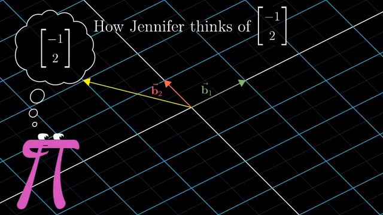

**[Watch on YouTube](https://www.youtube.com/watch?v=P2LTAUO1TdA)**

### The Big Idea

Different coordinate systems (different basis vectors) describe the same vectors with different numbers. **Change of basis** is the translation process between these descriptions.

### The Setup

You use the standard basis {i-hat, j-hat}. Your friend Jennifer uses a different basis {b1, b2}.

The same geometric vector has **different coordinates** in different bases:

- In your basis: `[3, 2]`
- In Jennifer's basis: `[5/3, 1/3]`

### Translating Between Bases

**Jennifer's language → Your language**: If Jennifer says `[5/3, 1/3]`, she means `5/3 * b1 + 1/3 * b2`. If you write b1 and b2's coordinates (in your basis) as columns of a matrix **B**, then:

```
Your coordinates = B * Jennifer's coordinates
```

The matrix B (whose columns are Jennifer's basis vectors in your coordinates) is a **change-of-basis matrix**.

**Your language → Jennifer's language**: Use the inverse:

```
Jennifer's coordinates = B^(-1) * Your coordinates
```

### Translating Transformations

If you have a transformation matrix **A** (in your basis) and want to express it in Jennifer's basis:

```
A_jennifer = B^(-1) * A * B
```

Read right to left:
1. **B**: Translate from Jennifer's language to yours
2. **A**: Apply the transformation
3. **B^(-1)**: Translate the result back to Jennifer's language

This pattern `B^(-1) * A * B` is called a **similarity transformation** or **conjugation**, and it appears throughout linear algebra.

### Key Takeaway

> A matrix is always implicitly tied to a choice of basis. The expression **B^(-1) * A * B** is a mathematical "empathy" - it lets you see the same transformation from someone else's perspective.

---

## Chapter 14: Eigenvectors and Eigenvalues

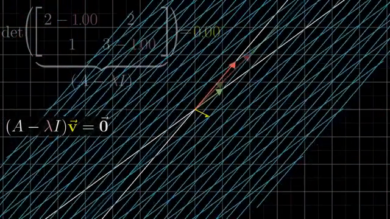

**[Watch on YouTube](https://www.youtube.com/watch?v=PFDu9oVAE-g)**

### The Big Idea

Most vectors get knocked off their span by a linear transformation. The special vectors that **stay on their own span** (only getting scaled) are called **eigenvectors**, and their scaling factors are **eigenvalues**.

### What Are Eigenvectors?

During a transformation:
- Most vectors change direction
- **Eigenvectors** only get stretched, squished, or flipped - they stay on the same line through the origin
- The factor by which they're scaled is the **eigenvalue**

```
A * v = λ * v
```

where v is the eigenvector and λ (lambda) is the eigenvalue.

### Geometric Examples

- **3D Rotation**: The axis of rotation is an eigenvector with eigenvalue 1 (it doesn't move at all)
- **2D Shear**: i-hat stays fixed (eigenvector with eigenvalue 1)
- **Scaling**: Every vector is an eigenvector

### How to Find Them

Rearrange A * v = λ * v:

```
(A - λI) * v = 0
```

This has a non-zero solution v only when:

```
det(A - λI) = 0
```

This is called the **characteristic equation**. Solving it gives the eigenvalues. Then plug each eigenvalue back in to find the eigenvectors.

### Why Eigenvalues Matter

**Eigenbasis**: If you can find a basis made entirely of eigenvectors, then in that basis, the transformation matrix is **diagonal** - each basis vector just gets scaled.

```
| λ1  0   0  |
| 0   λ2  0  |
| 0   0   λ3 |
```

Diagonal matrices are incredibly easy to work with. Raising them to powers, for example:

```
A^100 is trivial in an eigenbasis: just raise each diagonal entry to the 100th power
```

### Not Every Matrix Has an Eigenbasis

- A 2D rotation by 90 degrees has **no real eigenvectors** (no line stays on itself)
- Some matrices have fewer linearly independent eigenvectors than dimensions (a single eigenvalue with only one eigenvector direction)

### Key Takeaway

> Eigenvectors reveal the "natural axes" of a transformation - the directions along which the transformation acts most simply. Finding an eigenbasis transforms a complex operation into a trivial scaling.

---

## Chapter 15: A Quick Trick for Computing Eigenvalues

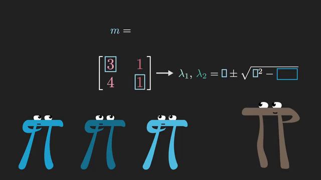

**[Watch on YouTube](https://www.youtube.com/watch?v=e50Bj7jn9IQ)**

### The Big Idea

For **2x2 matrices**, there's an elegant shortcut for finding eigenvalues using just the **mean** and **product** of the eigenvalues.

### The Two Key Facts

For a 2x2 matrix:

```
| a  b |
| c  d |
```

1. **Mean of eigenvalues** = (a + d) / 2 = (trace) / 2 = **m**
2. **Product of eigenvalues** = ad - bc = det = **p**

These come from:
- The trace (sum of diagonal entries) equals the sum of eigenvalues
- The determinant equals the product of eigenvalues

### The Formula

If the mean is **m** and the product is **p**, the two eigenvalues are:

```
λ = m ± √(m² - p)
```

This is derived from the fact that if two numbers have mean m and product p, they are the roots of:

```
x² - 2mx + p = 0
```

which gives `x = m ± √(m² - p)`.

### Example

For the matrix:

```
| 3  1 |
| 4  1 |
```

- Mean: m = (3 + 1) / 2 = 2
- Product: p = 3*1 - 1*4 = -1
- Eigenvalues: 2 ± √(4 - (-1)) = 2 ± √5

### When m² - p is Negative

If m² < p, the square root is imaginary, meaning the eigenvalues are complex. Geometrically, this corresponds to a **rotation** component in the transformation (no real eigenvectors).

### Key Takeaway

> For 2x2 matrices, you can find eigenvalues in your head: compute the mean and product of the diagonal (adjusted by the determinant), then use `m ± √(m² - p)`.

---

## Chapter 16: Abstract Vector Spaces

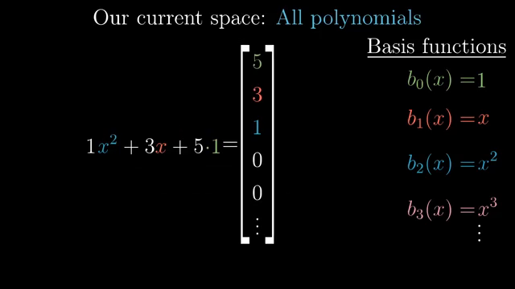

**[Watch on YouTube](https://www.youtube.com/watch?v=TgKwz5Ikpc8)**

### The Big Idea

Vectors aren't limited to arrows or number lists. **Functions, polynomials, and many other mathematical objects** behave like vectors. The abstract definition unifies all of these under one framework.

### The Abstraction

A **vector space** is any collection of objects where you can:

1. **Add** two objects together
2. **Multiply** an object by a scalar

...and these operations follow certain natural rules (the axioms of a vector space).

### Functions as Vectors

Consider all polynomials of degree ≤ 2: things like `3x² + 2x + 1`.

- **Addition**: `(3x² + 2x + 1) + (x² - x + 4) = 4x² + x + 5` (add corresponding terms)
- **Scalar multiplication**: `2 * (3x² + 2x + 1) = 6x² + 4x + 2`

A "basis" for this space: `{1, x, x²}`. Every polynomial of degree ≤ 2 is a linear combination of these. The coordinates of `3x² + 2x + 1` in this basis are `[1, 2, 3]`.

### Linear Transformations on Function Spaces

The **derivative** is a linear transformation:

```
d/dx(f + g) = d/dx(f) + d/dx(g)     [additivity]
d/dx(c * f) = c * d/dx(f)            [scaling]
```

The derivative can be represented as a matrix in the basis {1, x, x²}:

```
| 0  1  0 |
| 0  0  2 |
| 0  0  0 |
```

Because: d/dx(1) = 0, d/dx(x) = 1, d/dx(x²) = 2x.

### The Axioms

The formal axioms ensure that vector addition and scalar multiplication "behave nicely":

1. **u + v = v + u** (commutativity)
2. **(u + v) + w = u + (v + w)** (associativity)
3. There exists a **zero vector** (additive identity)
4. Every vector has an **additive inverse**
5. **1 * v = v**
6. **(ab)v = a(bv)**
7. **a(u + v) = au + av** (distributivity)
8. **(a + b)v = av + bv** (distributivity)

These axioms are like a "checklist" - mathematicians verify them once, then all theorems about vector spaces (determinants, eigenvectors, etc.) apply automatically.

### Key Takeaway

> The power of abstraction: by defining "vector" broadly, insights from arrows-in-space apply to functions, differential equations, quantum states, and any structure satisfying the axioms. **Linear algebra is not about arrows - it's about the structure of addition and scaling.**

---

## Summary: The Roadmap

```
Vectors (Ch 1)
    │
    ├── Basis, Span, Independence (Ch 2)
    │
    ├── Linear Transformations = Matrices (Ch 3)
    │       │
    │       ├── Composition = Matrix Multiplication (Ch 4)
    │       ├── 3D Transformations (Ch 5)
    │       ├── Determinant = Area/Volume Scaling (Ch 6)
    │       ├── Inverse, Column Space, Null Space (Ch 7)
    │       └── Nonsquare Matrices (Ch 8)
    │
    ├── Dot Product ↔ Duality (Ch 9)
    │       └── Cross Product ↔ Duality (Ch 10-11)
    │
    ├── Cramer's Rule via Areas (Ch 12)
    │
    ├── Change of Basis (Ch 13)
    │
    ├── Eigenvectors & Eigenvalues (Ch 14-15)
    │
    └── Abstract Vector Spaces (Ch 16)
```

### Core Principles to Remember

1. **Think geometrically first, compute second.** Every operation has a visual meaning.
2. **Matrices are transformations.** Columns tell you where basis vectors land.
3. **The determinant measures scaling.** Zero determinant = dimensional collapse.
4. **Duality connects vectors and transformations.** Dot products are secretly linear transformations.
5. **Eigenvectors are the natural axes.** They simplify everything.
6. **Linear algebra transcends arrows.** The same framework applies to functions, signals, quantum states, and more.

---

*This study guide was generated by extracting and processing transcripts from all 16 videos using [VideoDB](https://videodb.io), then synthesizing the content into structured notes.*
